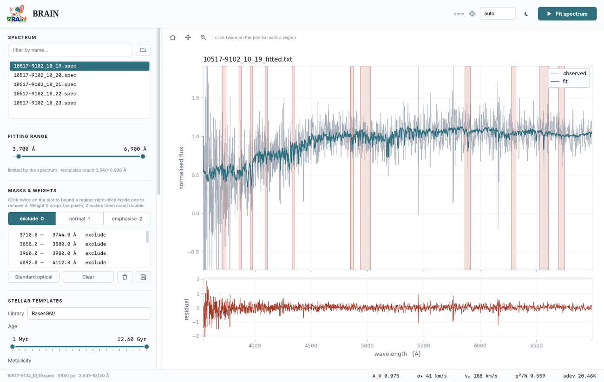
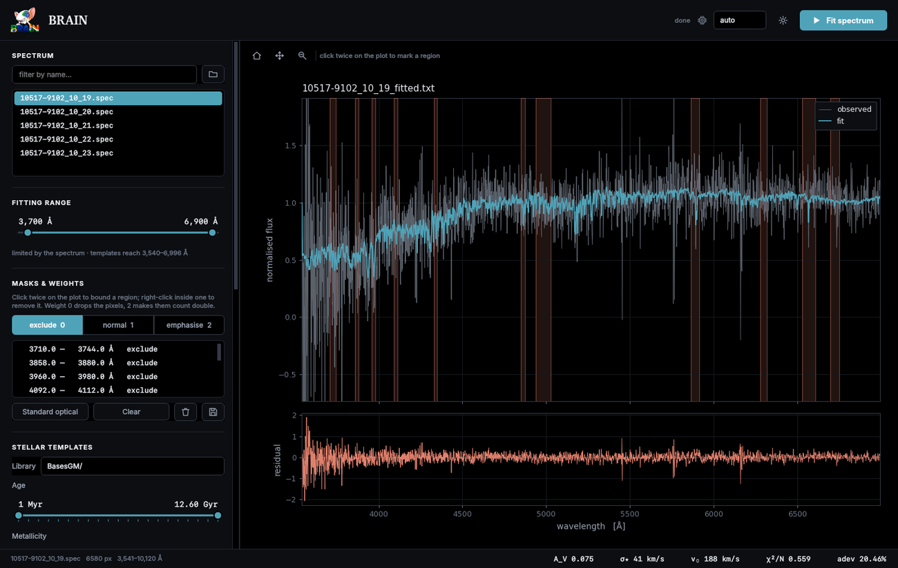

# The desktop interface

```bash
python brain_gui.py
```



Everything in `brain_setup.yaml` is here as a control, plus a few things that
only make sense with a spectrum in front of you. It is a native application —
Qt, not a browser — and runs the same on Linux, macOS and Windows.

---

## The header

| Control | What it does |
|---|---|
| **device** | `auto`, `cpu` or `gpu`. `auto` uses a GPU when JAX can see one |
| :material-weather-night: | Switches between light and dark, plot included |
| **Fit spectrum** | Runs the fit in a background thread; the window stays responsive |

---

## Choosing a spectrum

Point the folder button at a directory and filter by name. The spectrum is
drawn as soon as you select it, with the part inside the fitting range picked
out and the rest greyed back.

The status bar along the bottom shows the file, its pixel count and its
wavelength span.

---

## The fitting range

The slider is bounded by what the data and the templates can **both** support,
and the caption tells you which of the two is binding:

```
limited by the templates · spectrum spans 3,541–10,120 Å
```

This is not cosmetic. Outside the template coverage every model column is zero,
so the model there is identically zero — the fit would silently reproduce
nothing and carry the resulting mismatch into $\chi^2$. The slider will not let
you go there.

---

## Masks and weights

Click twice on the plot to bound a region; right-click inside one to remove it.
Pick a weight first — exclude, normal or emphasise. Fully described in
[Masks and weights](masks.md).

---

## Stellar templates

Pick a library, then use the two range sliders to choose which ages and
metallicities are on the menu. The sliders snap to the values that actually
exist in the catalogue, and the caption keeps a running count:

```
21 ages × 4 metallicities  →  84 templates
```

Fewer templates fit faster and are less degenerate, but describe a coarser
star-formation history. **Include an AGN power-law component** adds a
featureless continuum — leave it off for normal galaxies, since switching it on
where there is no AGN lets it absorb light that belongs to real stars.

---

## Nebular treatment

The three modes are described in [Nebular modes](modes.md). The interface shows
a one-line summary of the selected mode and warns you about situations it
cannot fix, such as:

> The Balmer jump at 3646 Å is outside the fitting range, so the nebular
> continuum is weakly constrained and may trade against A_V.

---

## Dust and kinematics

Twelve [extinction laws](extinction.md), labelled by the dust they describe
rather than by citation, with the reference shown underneath. Then range
sliders for $A_V$, stellar velocity and velocity dispersion.

---

## Fit quality

| Control | Meaning |
|---|---|
| **Smoothness** | Regularisation strength. Higher gives smoother star-formation histories |
| **Error samples** | Monte Carlo resamples for error bars. `0` skips them, and is much faster |
| **Reject outlier pixels** | Clips pixels the model cannot explain, then refits |
| **Also save a PDF plot** | Writes a publication-ready figure alongside the text output |

---

## The plot



Above the plot:

| Tool | Does |
|---|---|
| :material-home: | Resets the view |
| :material-cursor-move: | Drag to pan |
| :material-magnify: | Drag a box to zoom in |

The **mouse wheel** zooms the wavelength axis about the pointer; hold ++shift++
to zoom the flux axis instead. A live readout on the right follows the cursor.

Your zoom **survives mask edits** — marking a region while zoomed in does not
throw you back out to the full spectrum, which is exactly when being zoomed
matters most.

After a fit the panel shows the observed spectrum, the total fit, and where
they differ, the stellar and emission components separately. The lower panel
shows residuals. In a purely stellar fit the total and the stellar curve are
the same thing, so only one is drawn.

The status bar fills with the headline numbers:

```
A_V 0.232      σ★ 59 km/s      v₀ 176 km/s      χ²/N 0.587      adev 16.90%
```

---

## Installing it as an application

```bash
python install_desktop.py
```

Adds BRAIN to your applications menu with its icon — a `.desktop` entry on
Linux, an `.app` bundle on macOS, a Start Menu shortcut on Windows.
`--remove` undoes it.

---

## Notes

The interface opens on the monitor holding the terminal you launched it from,
rather than always on the primary display. Under Wayland this falls back to the
screen under the pointer, because compositors do not let a client ask where
other windows are.
