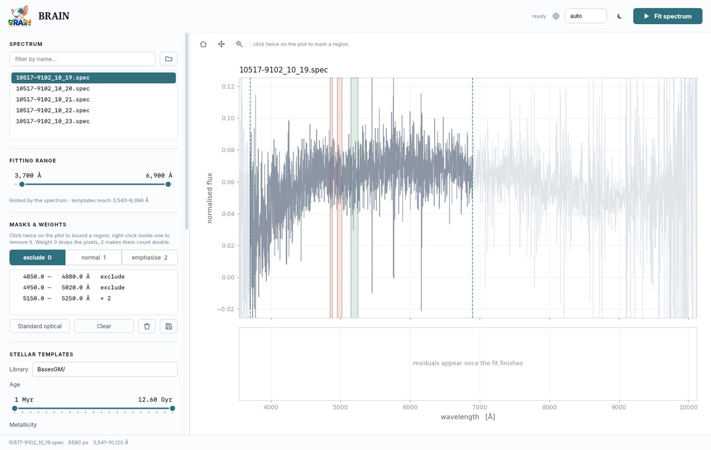

# Masks and weights

Masking tells BRAIN which pixels to ignore — sky residuals, bad columns,
detector artefacts, emission lines you have chosen not to model. Weighting goes
one step further and tells it which pixels matter *more* than the rest.

---

## The file format

One region per line:

```
# start     end       weight
3710.00     3744.00   0.00
3858.00     3880.00   0.00
5150.00     5250.00   2.00
```

| Weight | Effect |
|---|---|
| `0` | The pixels are dropped from the fit entirely |
| `1` | Normal — the same as not listing the region at all |
| `2` | These pixels count double |

The weight column is **optional and defaults to 0**, so a plain two-column file
of regions-to-exclude works exactly as it always did.

Later regions override earlier ones, so you can list a broad exclusion and then
carve an exception out of it.

### How the weight enters the fit

The weight multiplies the $\chi^2$ contribution of each pixel once:

$$ \chi^2 = \sum_\lambda w_\lambda \left[ \frac{F_{\rm obs}(\lambda) - F_{\rm model}(\lambda)}{\sigma(\lambda)} \right]^2 $$

Internally this is applied as $\sqrt{w}/\sigma$ in the inverse-variance vector,
so a weight of 2 is equivalent to having observed that pixel twice.

!!! note "Up-weighting is not free"
    Doubling the weight on a feature makes the fit respect it at the expense
    of everything else. It is the right tool when you know a particular
    absorption feature carries the information you care about, and the wrong
    one if you are simply unhappy with a residual.

---

## Drawing masks in the interface



1. Choose a weight — **exclude 0**, **normal 1** or **emphasise 2**
2. **Click twice** on the plot to bound a region
3. **Right-click** inside a region to delete it

Excluded regions are drawn in red, emphasised ones in green. The list below the
buttons shows every region with its limits and weight.

| Button | Does |
|---|---|
| **Standard optical** | Loads the eleven usual regions in one click |
| **Clear** | Removes everything |
| :material-delete: | Removes the region selected in the list |
| :material-content-save: | Writes the regions to a file for reuse |

Masks drawn in the interface are written to `brain_out/_gui_mask.txt` when you
fit, so the run is reproducible from the settings file afterwards.

!!! tip
    While **Pan** or **Zoom** is active, clicks belong to the navigation tool
    and will not create regions. Turn them off to go back to masking.

---

## The standard optical mask

The eleven regions loaded by *Standard optical* cover the sky residuals and
strong emission lines that a stellar-only fit should not try to reproduce:

| Range (Å) | What it is |
|---|---|
| 3710–3744 | [O II] λ3727 |
| 3858–3880 | [Ne III], H8 |
| 3960–3980 | [Ne III], Hε |
| 4092–4112 | Hδ |
| 4330–4350 | Hγ |
| 4848–4874 | Hβ |
| 4940–5028 | [O III] λλ4959, 5007 |
| 5866–5916 | He I, Na D sky |
| 6280–6320 | Telluric |
| 6528–6608 | Hα, [N II] λλ6548, 6584 |
| 6696–6752 | [S II] λλ6716, 6731 |

In `off` mode these regions should be masked, because the lines are not fitted
and leaving them in drags the continuum. In `continuum` and `full` mode the
lines *are* fitted, and BRAIN automatically restores pixels inside the line
windows so they can be used.

---

## Using a mask from the settings file

```yaml
mask: examples/mask_10517-9102_10_19.txt
```

Leave it blank for no mask.
