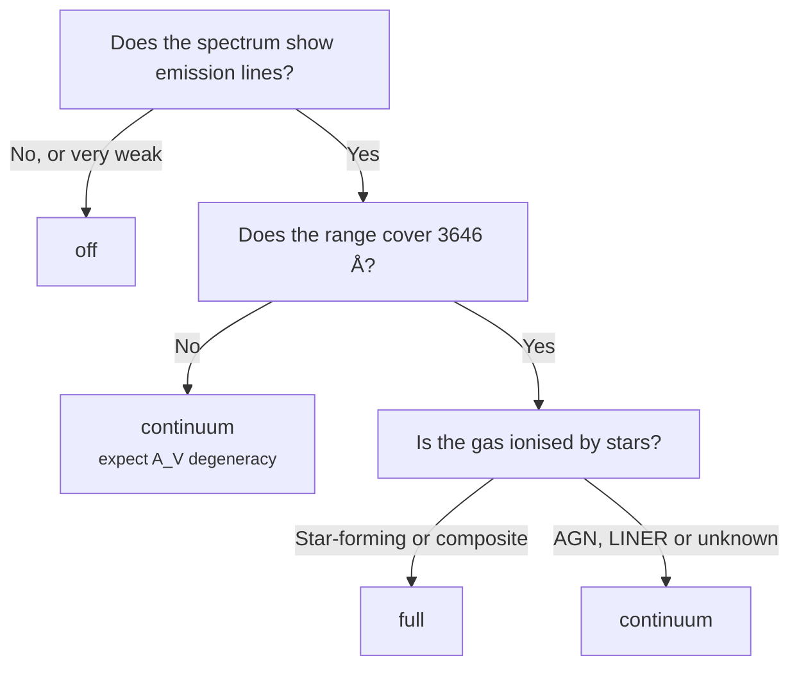

# Nebular modes

Young stars emit ultraviolet photons that ionise the gas around them, and that
gas glows back — in emission lines, and in a smooth **nebular continuum** made
of free-free, free-bound and two-photon emission. That continuum is not flat.
It has a Balmer jump at 3646 Å and it rises towards the red, so if it is present
and you do not model it, the fit compensates with the only knobs it has: dust
and the star-formation history.

BRAIN offers three levels of treatment.

---

## `off` — stellar only

```yaml
nebular_mode: "off"
```

The emission lines are **not fitted at all**. They stay masked, and the model
is purely stellar.

It is the fastest option and the correct
one for passive galaxies, or for any spectrum where the lines are weak enough
that ignoring them costs nothing.

| | |
|---|---|
| Cost | ~1.3 CPU-seconds per spectrum |
| Fits | Stars, dust, stellar kinematics |
| Requires | Nothing beyond a spectrum |

!!! note
    Mask the emission lines when using this mode — the *Standard optical* mask
    in the interface does it in one click. Unmasked lines drag the continuum.

---

## `continuum` — nebular continuum as a fitted component

```yaml
nebular_mode: "continuum"
```

Emission lines are fitted with free amplitudes, and the nebular continuum is
added as an extra column in the linear system with a free weight of its own.
Its **shape** is computed from the gas physics — temperature, density, helium
abundance — but its **strength** is whatever the data prefer.

Use this when the emission lines are strong. It is the right default for
star-forming galaxies.

| | |
|---|---|
| Cost | ~2.8 CPU-seconds per spectrum |
| Adds | Emission lines, nebular continuum with a free weight |
| Measures | $n_e$, $T_e$, Balmer decrement, BPT class |

!!! warning "The Balmer jump matters"
    The nebular continuum's most distinctive feature is the jump at 3646 Å. If
    your fitting range starts redward of that, the continuum is a smooth,
    slowly rising function — nearly degenerate with dust reddening. BRAIN warns
    you when this is the case:

    > Nebular continuum is weakly constrained: Balmer jump (3646 Å) lies
    > outside the fitted range 3700–6898 Å. It may trade against A_V.

    The fit will still run. Treat the resulting $A_V$ and nebular strength as
    a joint constraint rather than two independent measurements.

---

## `full` — self-consistent

```yaml
nebular_mode: "full"
```

Everything `continuum` does, plus a self-consistency loop: the hydrogen line
strengths and the nebular continuum are **tied to the ionising photon budget**
$Q(H)$ of the stellar populations the fit has found.

This is the physically complete picture. A stellar population that produces
enough ultraviolet light to power the observed Hβ must be present in the fit,
and one that is not cannot be.

| | |
|---|---|
| Cost | ~6.3 CPU-seconds per spectrum |
| Adds | $Q(H)$ self-consistency between stars and gas |
| Runs | An outer loop, typically 5 iterations of the full fit |

### The BPT gate

`full` only makes sense if stars are what ionise the gas. If an active nucleus
or shocks are doing the ionising, the ionising budget of a stellar population
is the wrong constraint entirely — imposing it would force the fit to invent
young stars that are not there.

So BRAIN classifies the spectrum on a BPT diagram first and **drops to
`continuum` automatically** when the classification is not star-forming or
composite:

```
BPT class: undetermined — dropping 'full' to 'continuum' (one or more BPT
lines undetected). The ionising-photon budget of a stellar population cannot
be assumed to power this spectrum.
```

Classification follows Kauffmann et al. (2003), Kewley et al. (2001) and
Schawinski et al. (2007). It needs Hβ, [O III] λ5007, Hα and [N II] λ6584 to
be detected; if any are missing the class is *undetermined* and the gate
closes.

---

## Which to use



---

## Gas conditions

In `continuum` and `full` mode BRAIN measures the gas conditions from the
spectrum itself rather than assuming them:

| Quantity | Diagnostic | Reference |
|---|---|---|
| Electron density $n_e$ | [S II] λ6716/λ6731 | Proxauf et al. (2014) |
| Electron temperature $T_e$ | [O III] λ4363/λ5007 | Osterbrock & Ferland, Eq. 5.4 |

Where a diagnostic is unavailable — the lines too weak, or outside the range —
the values from `gas_temperature` and `gas_density` in the settings file are
used instead.
