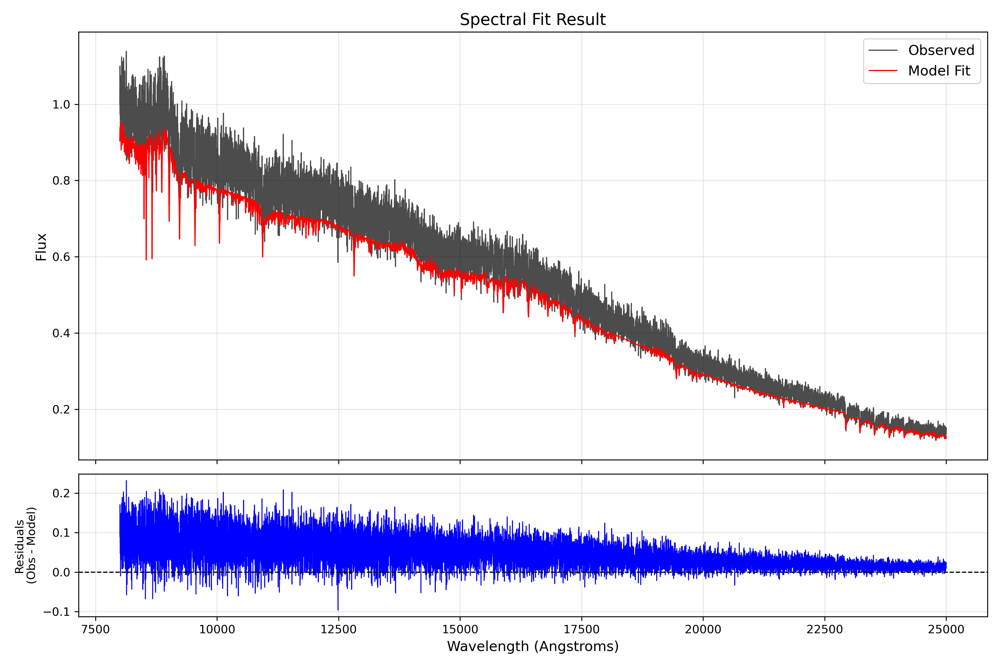
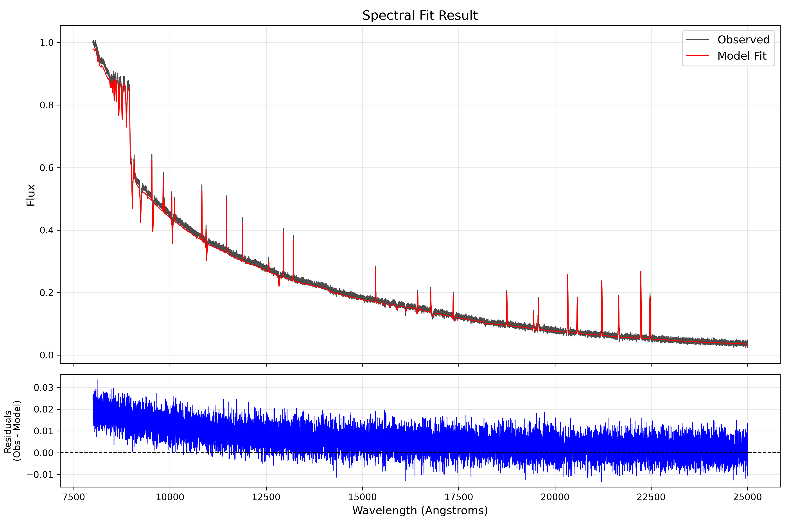

# Performance & Results

This page showcases the fitting capabilities of the `brainv1` updated pipeline when tested against complex, composite galaxies. The optical pipeline is currently heavily tuned to effectively decouple stellar absorption from surrounding ionized nebulae.

---

## NGC 1022 Optical Fit Demonstration

The plots below visualize an observed integrated spectrum from the galaxy NGC 1022. Achieving an accurate fit requires matching both the complex continuum slope (using our multi-degree Legendre polynomials) and the sharp highly-ionized gas features over-imposed on the deep stellar absorption lines.

**Spectral Validation:**
- The grey line indicates the observed input spectrum.
- The red line indicates the final `total_fit` produced by the Levenberg-Marquardt optimizer coupled to the Regularized NNLS solver.

A zoomed or alternate version of the integrated fit showcasing high-frequency alignment:

### Performance Highlights

| Metric | Result | Note |
|---|---|---|
| **Fit Speed** | ~3-5 seconds | The Levenberg-Marquardt wrapper computes 5D kinematics exponentially faster than standard MCMC. |
| **Physical Enforcement** | ✅ Passed | Fixed [N II] 6548/6584 ratio forces the code to fit the complex H-alpha + [NII] blend accurately without overfitting noise. |
| **Continuum Matching** | ✅ Passed | The degree-12 Legendre Polynomial seamlessly wraps the synthetic SSP spectrum around the observed continuum. |

Our implementation demonstrates results directly competitive with recognized tools like pPXF and STARLIGHT, utilizing purely pythonic, native solver architectures.
